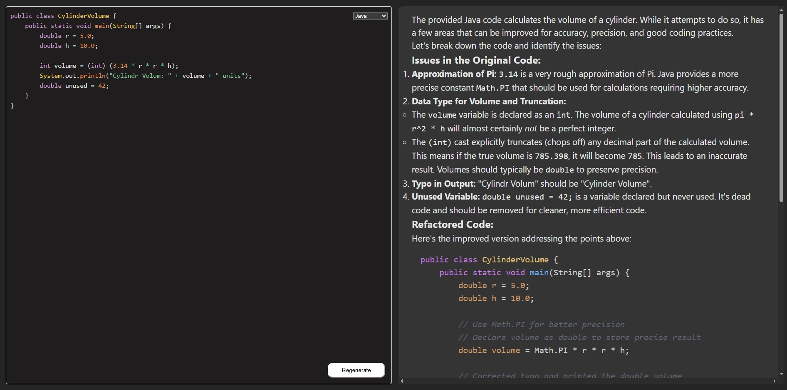

# OopsFinder your AI Code Reviewer 🤖

Welcome to the Oopsinder! This tool automatically analyzes your code, highlights potential issues, and suggests improvements to help you write cleaner, more efficient code — all powered by Gemini 2.5 Flash.

## Features
- Supports multiple programming languages including Java and Python
- Provides actionable feedback with code examples
- Saves time during code reviews by automating the first pass

---

## Example Reviews

### Java Code Review
  
*An example of the AI reviewing a Java file, highlighting syntax and logic suggestions.*

---

### Python Code Review
  
*Here’s how the AI evaluates a Python script, pointing out potential bugs and style improvements.*

---

Feel free to try it out and see how AI can streamline your code review process!
